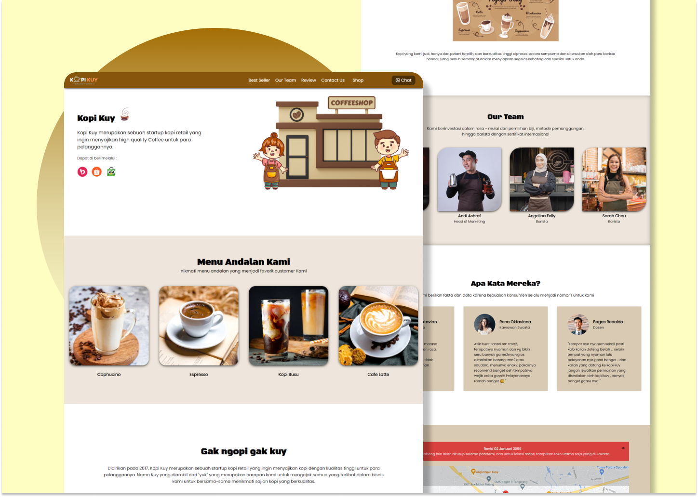

<h1 align="center">Kopi Kuy ☕</h1>

Selamat datang di website profil perusahaan **Kopi Kuy**! Proyek ini dibangun sebagai bagian dari pelatihan saya di **Xpertrainer** dengan judul kursus "Belajar Membangun Website untuk Memulai Karir sebagai Software Developer". Website ini menampilkan profil perusahaan Kopi Kuy serta halaman toko yang menampilkan produk-produknya, yang ditampilkan secara dinamis dari file JSON.

	<a href="https://zuyinatink.github.io/kopi-kuy/">View Demo</a>·

## Daftar Isi

- [Preview](#preview)
- [Tentang Proyek](#tentang-proyek)
- [Teknologi yang Digunakan](#teknologi-yang-digunakan)
- [Struktur Proyek](#struktur-proyek)
- [Instalasi](#instalasi)
- [Penggunaan](#penggunaan)
- [Kesimpulan](#kesimpulan)

## Preview 🚀
